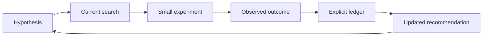
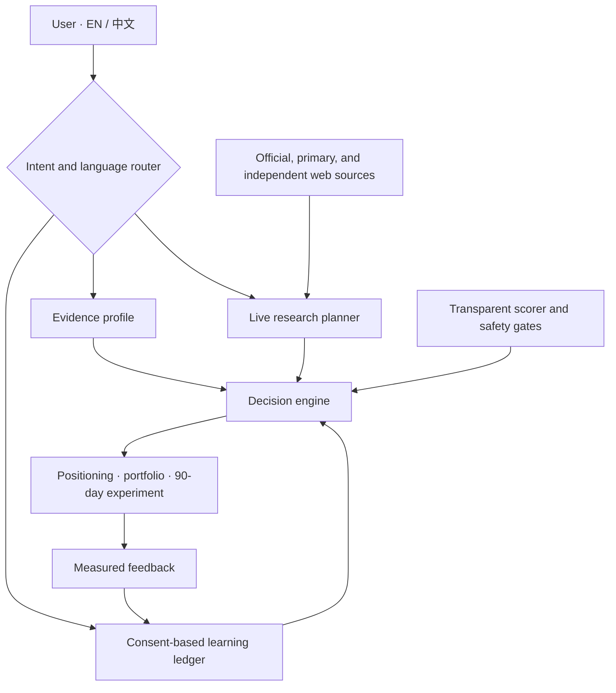

<h1 align="center">Sunshine · Digital Nomad Wealth Navigator</h1>

<p align="center"></p>

<p align="center"><strong>English</strong> | <a href="README.zh-CN.md">简体中文</a></p>

<p align="center"><strong>Turn an unusual mix of skills into a portable, evidence-backed global edge.</strong><br>
Live market intelligence · Opportunity portfolio · 90-day experiments · Explicit learning</p>

<p align="center">
  <a href="docs/media/sunshine-workflow.svg"></a>
</p>

<p align="center"><em>Profile → search → decide → test → learn → compound.</em><br>
<a href="docs/media/sunshine-workflow.svg">Full-size workflow</a> · <a href="#software-architecture">Architecture</a></p>

<p align="center">
  <a href="#quick-start"></a>
  <a href="#live-intelligence-and-explicit-learning"></a>
  <a href="README.zh-CN.md"></a>
  <a href=".github/workflows/validate.yml"></a>
  <a href="LICENSE"></a>
</p>

<p align="center">
  <a href="#try-it">✨ Try it</a> ·
  <a href="#user-experience">🧭 User journey</a> ·
  <a href="#software-architecture">🧩 Architecture</a> ·
  <a href="#quick-start">🚀 Install</a> ·
  <a href="docs/USER_RESEARCH.md">📊 Research</a> ·
  <a href="PRIVACY.md">🔐 Privacy</a> ·
  <a href="SUPPORT.md">💬 Support</a>
</p>

Sunshine is a bilingual WorkBuddy / SkillHub skill for researchers, educators, creators, consultants, product builders, freelancers, and other knowledge workers exploring a cross-border career or business. It does more than suggest jobs or cities: it turns expertise, interests, proof, networks, and constraints into three testable options—a near-term cash engine, a reusable evidence asset, and a long-term option.

“Wealth” means a scarce, portable, verifiable, compounding advantage in a chosen intersection. It is a product metaphor, never an income promise.

## Why it is different

| Typical tool | Usually answers | Sunshine adds |
|---|---|---|
| Career quiz | “Which role fits me?” | Buyer value, proof, portability, and a reversible test |
| Digital-nomad guide | “Where should I go?” | A resilient work and income design before relocation |
| Generic web search | “What information exists?” | Bilingual query expansion, source grading, contradiction checks, and an as-of date |
| One-off coaching | “What should I do now?” | An explicit learning ledger that improves the next recommendation from observed outcomes |

## User experience

| Moment | User action | What the skill does | Visible output |
|---|---|---|---|
| 1 · Map | Share goals, evidence, interests, and constraints | Separates facts, statements, inferences, assumptions, and unknowns | Compound-advantage profile |
| 2 · Search | Ask for current opportunities or comparisons | Searches in the user’s language and English, prioritizes primary sources, and checks dates | Cited intelligence snapshot |
| 3 · Decide | Compare paths, buyers, countries, or business models | Scores options by evidence speed, reversibility, portability, and risk | Three-layer opportunity portfolio |
| 4 · Test | Pick one lighthouse experiment | Sets one observable milestone for each 30-day phase | 90-day plan with continue / adjust / stop gates |
| 5 · Learn | Return with outcomes and feedback | Appends an auditable event—with permission—and updates only supported hypotheses | Change log and next best experiment |

## Live intelligence and explicit learning

The skill is **search-first for time-sensitive claims**. When tools are available, it refreshes compensation, market demand, platform rules, prices, visas, tax, regulation, living costs, and competitor information in the current session. It records an as-of date, cites sources next to claims, prefers official or primary material, and marks unresolved conflicts instead of guessing. Details live in [the research and learning protocol](.agents/skills/sunshineluyao-digital-nomad-wealth/references/research-and-learning.md).

Its “self-learning” is intentionally transparent: it learns from a user-approved ledger of experiments and outcomes. It does **not** secretly retrain a model, claim permanent memory, or continue searching after the session ends.



## Software architecture



The skill instructions route the conversation. The research protocol governs freshness, multilingual queries, source quality, and competitor comparison. The deterministic scorer compares evidence-backed options. The optional local ledger preserves raw feedback; recommendations remain generated and reviewable rather than silently changing code or model weights. See [architecture notes](docs/ARCHITECTURE.md).

## Try it

- “I combine economics, data visualization, and AI tools. Find current global buyer signals and design a remote offer.”
- “Compare research, independent consulting, and knowledge products. Give me a low-cost 90-day test.”
- “Use my CV and portfolio to identify two defensible interdisciplinary advantages. Separate evidence from assumptions.”
- “I want location freedom without depending on one employer. Design a resilient income portfolio and its risk gates.”
- “Here are this quarter’s customers, artifacts, and results. What did we learn, and what should change next?”

The skill replies in the user’s language. Ask for “中英双语 / bilingual” to receive both versions.

## Quick start

### WorkBuddy

**GitHub import:** connect GitHub, select this repository on its default `main` branch, and choose the detected skill at `.agents/skills/sunshineluyao-digital-nomad-wealth`.

**Local import:**

1. Download this repository as a ZIP.
2. In WorkBuddy, open **Skills → Upload skill**.
3. Select the `.agents/skills/sunshineluyao-digital-nomad-wealth` folder whose root contains `SKILL.md`.

Review the files before import. This release needs no API key and does not upload a private learning ledger by itself.

Current web research uses whichever search capability the host makes available and can consume additional WorkBuddy credits. The skill never requests credentials. Persistent learning is optional, local, inspectable, and performed only after explicit permission. Read the [privacy and permissions notice](PRIVACY.md).

### Transparent scoring

```bash
python3 .agents/skills/sunshineluyao-digital-nomad-wealth/scripts/score_profile.py .agents/skills/sunshineluyao-digital-nomad-wealth/examples/sample-input.json
python3 -m unittest discover -s tests -v
```

The score compares options and reveals bottlenecks; it does not predict income. See the [assessment framework](.agents/skills/sunshineluyao-digital-nomad-wealth/references/assessment-framework.md).

### Optional learning ledger

```bash
python3 .agents/skills/sunshineluyao-digital-nomad-wealth/scripts/learning_ledger.py init learning-ledger.json
python3 .agents/skills/sunshineluyao-digital-nomad-wealth/scripts/learning_ledger.py add learning-ledger.json .agents/skills/sunshineluyao-digital-nomad-wealth/examples/learning-event.example.json
python3 .agents/skills/sunshineluyao-digital-nomad-wealth/scripts/learning_ledger.py summary learning-ledger.json
```

The file is local, inspectable, append-only through the helper, and ignored by Git. Use ranges or pseudonyms; do not put credentials, identity documents, client secrets, or employer-confidential material in it.

## Publish to SkillHub

The single `main` branch uses standards-compliant Agent Skills frontmatter so GitHub discovery can read it. In SkillHub's GitHub importer, select `sunshineluyao-digital-nomad-wealth`, then confirm the display name, version, summary, license, icon, and release note from [the listing kit](docs/SKILLHUB_LISTING.md) in step 2.

See the [release checklist](docs/RELEASE_CHECKLIST.md) and the official [SkillHub publishing guide](https://skillhub.cloud.tencent.com/tutorials#publish-via-cli).

## Project map

| Path | Purpose |
|---|---|
| [`.agents/skills/sunshineluyao-digital-nomad-wealth/SKILL.md`](.agents/skills/sunshineluyao-digital-nomad-wealth/SKILL.md) | Discoverable skill entrypoint, routing, research rules, and safety |
| [`references/research-and-learning.md`](.agents/skills/sunshineluyao-digital-nomad-wealth/references/research-and-learning.md) | Freshness, competitor search, source scoring, and learning protocol |
| [`scripts/score_profile.py`](.agents/skills/sunshineluyao-digital-nomad-wealth/scripts/score_profile.py) | Transparent seven-axis profile score |
| [`scripts/learning_ledger.py`](.agents/skills/sunshineluyao-digital-nomad-wealth/scripts/learning_ledger.py) | Local, consent-based experiment ledger |
| [`docs/USER_RESEARCH.md`](docs/USER_RESEARCH.md) | WorkBuddy demand and competition scan |
| [`docs/MONETIZATION.md`](docs/MONETIZATION.md) | Free-to-paid hypotheses and validation plan |
| [`docs/SKILLHUB_LISTING.md`](docs/SKILLHUB_LISTING.md) | Paste-ready bilingual marketplace copy and prompts |
| [`docs/ACCEPTANCE_TESTS.md`](docs/ACCEPTANCE_TESTS.md) | Eight pre-release WorkBuddy acceptance cases |
| [`PRIVACY.md`](PRIVACY.md) | Data flow, permissions, retention, and deletion |
| [`SUPPORT.md`](SUPPORT.md) | Support and security-reporting routes |
| [`CHANGELOG.md`](CHANGELOG.md) | Versioned release history |

## Boundaries

Sunshine designs career and business experiments; it does not provide legal, tax, immigration, medical, or investment-trading advice. It cannot guarantee complete coverage of the web or that every source is correct. High-impact decisions require current official sources and qualified local professionals. It never promises income, clients, visas, admission, funding, or influence.

For data handling, see [Privacy](PRIVACY.md). For questions or security reports, see [Support](SUPPORT.md).

## License

MIT © 2026 Luyao (Sunshine) Zhang
