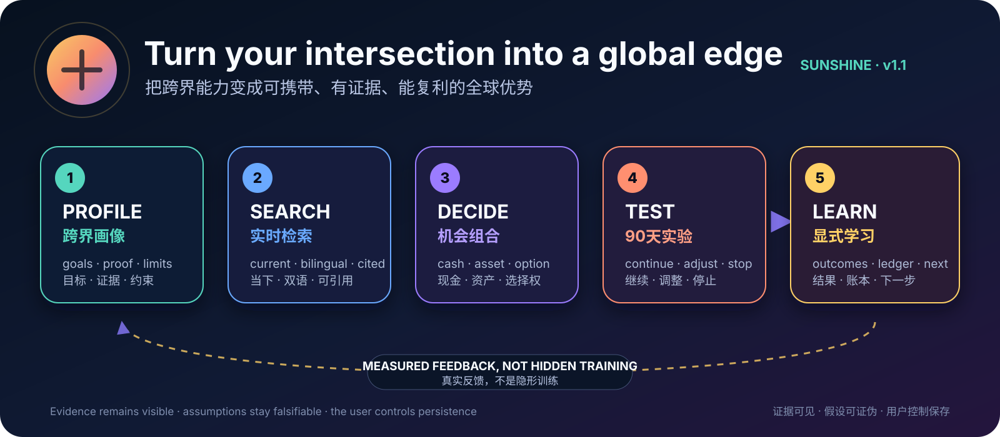
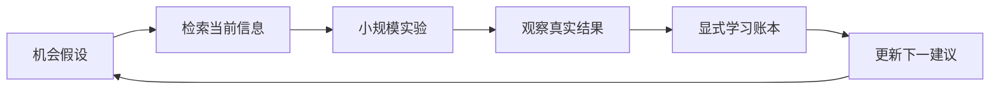
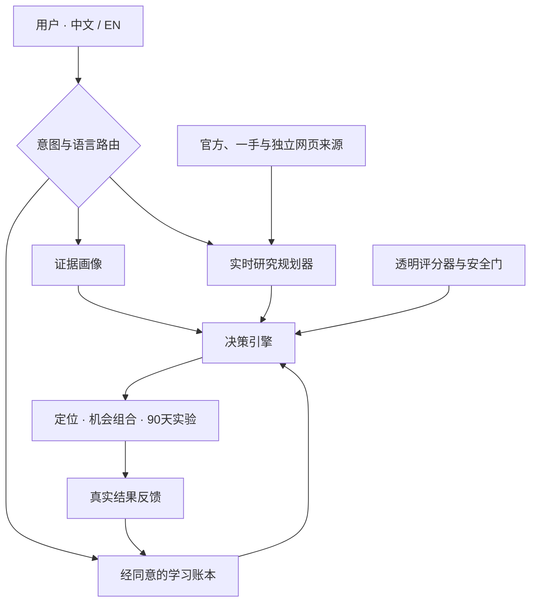

<h1 align="center">Sunshine · 跨界数字游民财富导航</h1>

<p align="center"></p>

<p align="center"><a href="README.md">English</a> | <strong>简体中文</strong></p>

<p align="center"><strong>把不寻常的能力组合，转化为可携带、有证据、能复利的全球优势。</strong><br>
实时市场情报 · 机会组合 · 90天实验 · 显式学习</p>

<p align="center">
  <a href="docs/media/sunshine-workflow.svg"></a>
</p>

<p align="center"><em>画像 → 检索 → 决策 → 实验 → 学习 → 复利。</em><br>
<a href="docs/media/sunshine-workflow.svg">查看完整流程图</a> · <a href="#软件架构">软件架构</a></p>

<p align="center">
  <a href="#快速开始"></a>
  <a href="#实时情报与显式学习"></a>
  <a href="README.md"></a>
  <a href=".github/workflows/validate.yml"></a>
  <a href="LICENSE"></a>
</p>

<p align="center">
  <a href="#试着这样问">✨ 立即体验</a> ·
  <a href="#用户体验流程">🧭 用户旅程</a> ·
  <a href="#软件架构">🧩 软件架构</a> ·
  <a href="#快速开始">🚀 安装</a> ·
  <a href="docs/USER_RESEARCH.md">📊 用户调查</a> ·
  <a href="PRIVACY.md">🔐 隐私</a> ·
  <a href="SUPPORT.md">💬 支持</a>
</p>

Sunshine 是面向 WorkBuddy / SkillHub 的双语技能，服务于希望跨界、出海或建立全球事业的科研人员、教育者、创作者、顾问、产品人、自由职业者及其他知识工作者。它不只推荐职位或城市，而是把专业、兴趣、作品、网络与约束转成三个可验证选项：近期现金引擎、可重复出售的证据资产、长期选择权。

这里的“首富/财富”指在交叉赛道中形成稀缺、可携带、可验证、可复利的优势，是产品隐喻，不是收入承诺。

## 它为什么不同

| 常见工具 | 通常回答 | Sunshine 增加的决策层 |
|---|---|---|
| 职业测试 | “我适合什么岗位？” | 买方价值、能力证据、可携带性与可逆实验 |
| 数字游民攻略 | “我应该去哪里？” | 迁移之前先设计有韧性的工作与收入结构 |
| 普通网页搜索 | “网上有什么信息？” | 中英双语扩展查询、来源分级、冲突检查与截至日期 |
| 一次性咨询 | “我现在该做什么？” | 用真实结果写入显式学习账本，改善下一次建议 |

## 用户体验流程

| 阶段 | 用户动作 | Skill 的工作 | 可见输出 |
|---|---|---|---|
| 1 · 画像 | 提供目标、证据、兴趣与约束 | 区分事实、用户陈述、推断、假设和未知项 | 跨界复利画像 |
| 2 · 检索 | 要求寻找当下机会或进行比较 | 用用户语言和英文检索，优先一手来源并核对日期 | 带引用的情报快照 |
| 3 · 决策 | 比较路线、买方、国家或商业模式 | 按证据速度、可逆性、可携带性和风险评分 | 三层机会组合 |
| 4 · 实验 | 选择一个灯塔实验 | 每30天设置一个可观察里程碑 | 含继续 / 调整 / 停止条件的90天计划 |
| 5 · 学习 | 带回结果与反馈 | 经同意后追加可审计事件，只更新有证据支持的假设 | 变化说明与下一实验 |

## 实时情报与显式学习

对**可能变化的信息，本 Skill 采取先检索、后建议**。工具可用时，它会在当前会话中刷新薪酬、市场需求、平台规则、价格、签证、税务、监管、生活成本和竞争产品信息；每次标明“截至”日期，把引用放在相关结论旁边，优先官方或一手材料，并明确展示尚未解决的冲突。完整规则见[研究与学习协议](.agents/skills/sunshineluyao-digital-nomad-wealth/references/research-and-learning.md)。

它的“自学习”是透明且可控的：根据用户批准保存的实验和结果账本调整后续建议。它不会秘密训练模型，不会声称拥有永久记忆，也不会在会话结束后继续搜索。



## 软件架构



`SKILL.md` 负责对话路由；研究协议管理信息新鲜度、双语检索、来源质量和竞品比较；确定性评分脚本比较有证据支持的选项；可选本地账本保留原始反馈。建议是可审查、可纠正的，不会静默修改代码或模型权重。详见[架构说明](docs/ARCHITECTURE.md)。

## 试着这样问

- “我会经济学、数据可视化和 AI 工具，帮我检索当前全球买方信号并设计远程产品。”
- “比较学术研究、独立咨询和知识产品，给我一个低成本90天验证计划。”
- “用我的简历和作品集找出两个有壁垒的跨界优势，并把证据与假设分开。”
- “我想获得地点自由，又不想依赖一个雇主，帮我设计有韧性的收入组合与风险门槛。”
- “这是本季度的客户、作品和结果。我们学到了什么？下一轮该改什么？”

Skill 默认跟随用户语言输出；说“中英双语 / bilingual”即可同时获得两个版本。

## 快速开始

### WorkBuddy

**GitHub 导入：**连接 GitHub，在默认 `main` 分支选择本仓库，然后选择系统识别出的 `.agents/skills/sunshineluyao-digital-nomad-wealth`。

**本地导入：**

1. 下载本仓库 ZIP；
2. 在 WorkBuddy 打开**技能 → 上传技能**；
3. 选择根目录含 `SKILL.md` 的 `.agents/skills/sunshineluyao-digital-nomad-wealth` 文件夹。

导入前可审查所有文件。本版本不需要 API Key，也不会自行上传私有学习账本。

实时研究使用宿主提供的可用检索能力，可能消耗额外 WorkBuddy 积分；Skill 不索取账号凭证。持久化学习为可选功能，只在明确授权后写入本地、可检查的账本。详见[隐私与权限说明](PRIVACY.md)。

### 透明评分

```bash
python3 .agents/skills/sunshineluyao-digital-nomad-wealth/scripts/score_profile.py .agents/skills/sunshineluyao-digital-nomad-wealth/examples/sample-input.json
python3 -m unittest discover -s tests -v
```

评分只用于比较选项和发现瓶颈，不预测收入。完整锚点见[评估框架](.agents/skills/sunshineluyao-digital-nomad-wealth/references/assessment-framework.md)。

### 可选学习账本

```bash
python3 .agents/skills/sunshineluyao-digital-nomad-wealth/scripts/learning_ledger.py init learning-ledger.json
python3 .agents/skills/sunshineluyao-digital-nomad-wealth/scripts/learning_ledger.py add learning-ledger.json .agents/skills/sunshineluyao-digital-nomad-wealth/examples/learning-event.example.json
python3 .agents/skills/sunshineluyao-digital-nomad-wealth/scripts/learning_ledger.py summary learning-ledger.json
```

该文件保存在本地、可随时查看，辅助脚本只做追加，并且 Git 默认忽略它。请使用区间或化名；不要写入账号凭证、身份证件、客户秘密或雇主保密材料。

## 发布到 SkillHub

唯一的 `main` 分支使用符合 Agent Skills 标准的 frontmatter，供 GitHub 自动发现。在 SkillHub 的 GitHub 导入页选择 `sunshineluyao-digital-nomad-wealth`，然后在第二步依据[上架资料](docs/SKILLHUB_LISTING.md)确认展示名、版本、摘要、许可证、图标和发布说明。

参见[发布检查表](docs/RELEASE_CHECKLIST.md)和官方 [SkillHub 发布指南](https://skillhub.cloud.tencent.com/tutorials#publish-via-cli)。

## 项目地图

| 路径 | 作用 |
|---|---|
| [`.agents/skills/sunshineluyao-digital-nomad-wealth/SKILL.md`](.agents/skills/sunshineluyao-digital-nomad-wealth/SKILL.md) | 可被自动发现的 Skill 入口、路由、研究与安全规则 |
| [`references/research-and-learning.md`](.agents/skills/sunshineluyao-digital-nomad-wealth/references/research-and-learning.md) | 新鲜度、竞品检索、来源评分与学习协议 |
| [`scripts/score_profile.py`](.agents/skills/sunshineluyao-digital-nomad-wealth/scripts/score_profile.py) | 可解释的七维画像评分 |
| [`scripts/learning_ledger.py`](.agents/skills/sunshineluyao-digital-nomad-wealth/scripts/learning_ledger.py) | 本地、经同意的实验学习账本 |
| [`docs/USER_RESEARCH.md`](docs/USER_RESEARCH.md) | WorkBuddy 需求与竞争扫描 |
| [`docs/MONETIZATION.md`](docs/MONETIZATION.md) | 从免费到付费的假设与验证计划 |
| [`docs/SKILLHUB_LISTING.md`](docs/SKILLHUB_LISTING.md) | 可直接粘贴的双语上架文案与推荐提示词 |
| [`docs/ACCEPTANCE_TESTS.md`](docs/ACCEPTANCE_TESTS.md) | 八个上架前 WorkBuddy 验收场景 |
| [`PRIVACY.md`](PRIVACY.md) | 数据流向、权限、保留与删除规则 |
| [`SUPPORT.md`](SUPPORT.md) | 用户支持与安全问题反馈方式 |
| [`CHANGELOG.md`](CHANGELOG.md) | 版本化发布记录 |

## 边界

Sunshine 设计职业与商业实验，不提供法律、税务、移民、医疗或投资交易建议。它不能保证覆盖整个互联网，也不能保证每个来源都正确。重大决定必须核对当下官方信息并咨询当地持牌专业人士。它不承诺收入、客户、签证、录取、融资或影响力结果。

数据处理详见[隐私说明](PRIVACY.md)，使用或安全问题详见[支持说明](SUPPORT.md)。

## License

MIT © 2026 Luyao (Sunshine) Zhang
