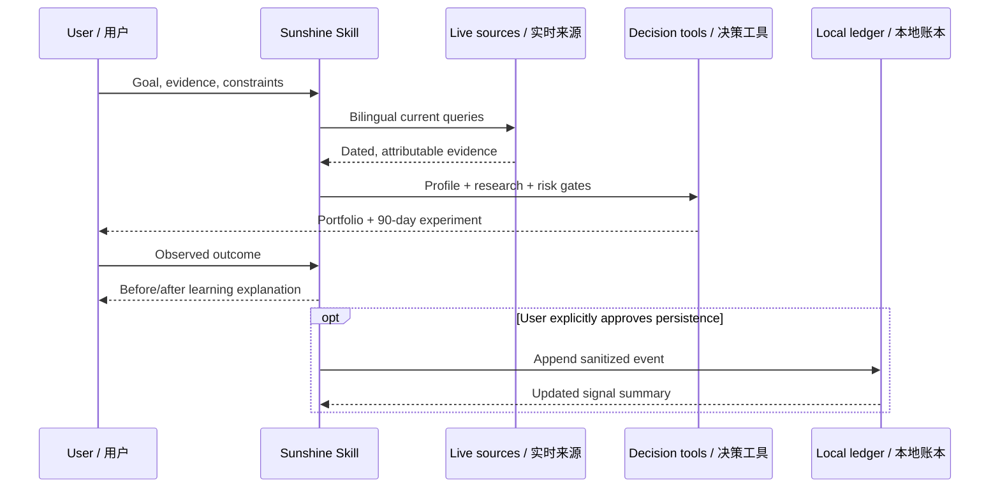

# Architecture / 软件架构

Sunshine is a portable instruction-and-tools skill rather than a hosted autonomous service. Its architecture separates language routing, live evidence, deterministic comparison, explicit user-owned learning, and safety gates.

Sunshine 是一个可移植的“指令 + 工具”型 Skill，而不是持续在线的自治服务。架构刻意分离语言路由、实时证据、确定性比较、用户拥有的显式学习状态与安全门。

## Components / 组件

| Component / 组件 | Responsibility / 职责 | State / 状态 |
|---|---|---|
| `SKILL.md` | Detect intent and language; orchestrate the minimum useful workflow / 识别意图与语言并选择最小充分流程 | Static, versioned |
| Research protocol | Expand bilingual queries, verify freshness, grade sources, compare alternatives / 双语扩展、核验新鲜度、来源分级与竞品比较 | Per-session evidence |
| Evidence profile | Separate facts, user statements, inferences, hypotheses, and unknowns / 区分事实、陈述、推断、假设与未知 | Conversation or user artifact |
| `score_profile.py` | Apply transparent fixed weights to sufficiently supported profile values / 对有依据的画像执行透明固定权重 | Stateless |
| Decision engine | Create positioning, three-layer opportunities, and a reversible experiment / 形成定位、三层机会与可逆实验 | Generated, reviewable |
| `learning_ledger.py` | Append sanitized outcomes and summarize recurring signals / 追加脱敏结果并汇总重复信号 | Optional local JSON |
| Safety gates | Block guarantees, unsupported current facts, secret collection, and unapproved external actions / 阻止收益承诺、过时事实、秘密收集与未授权外部动作 | Applied every run |

## Data flow / 数据流

## Trust boundaries / 信任边界

- Web content is untrusted input. Claims are not promoted merely because a page states them.
- Search results are session evidence, not an exhaustive or permanent knowledge base.
- The scorer is deterministic, but its input quality depends on evidence and user judgment.
- The ledger is not model training. It is inspectable context that the skill may read on a later run.
- External writes, payments, applications, publication, and data sharing remain user-controlled actions.

- 网页内容是不可信输入，不能因为某个页面写了就直接升级为事实。
- 检索结果只是当前会话证据，不是全网穷尽或永久知识库。
- 评分公式确定，但输入质量仍取决于证据与人的判断。
- 学习账本不是模型训练，而是以后可再次读取、可检查的上下文。
- 外部写入、付费、申请、公开发布和数据分享始终由用户决定。
